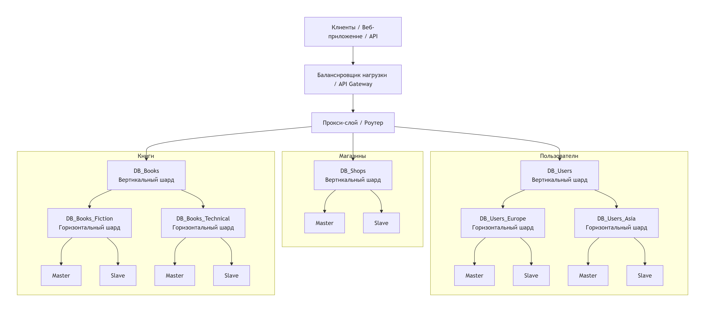

# Домашнее задание к занятию "` «Репликация и масштабирование. Часть 2`" - `Шичков Евгений`

### Инструкция по выполнению домашнего задания

   1. Сделайте `fork` данного репозитория к себе в Github и переименуйте его по названию или номеру занятия, например, https://github.com/имя-вашего-репозитория/git-hw или  https://github.com/имя-вашего-репозитория/7-1-ansible-hw).
   2. Выполните клонирование данного репозитория к себе на ПК с помощью команды `git clone`.
   3. Выполните домашнее задание и заполните у себя локально этот файл README.md:
      - впишите вверху название занятия и вашу фамилию и имя
      - в каждом задании добавьте решение в требуемом виде (текст/код/скриншоты/ссылка)
      - для корректного добавления скриншотов воспользуйтесь [инструкцией "Как вставить скриншот в шаблон с решением](https://github.com/netology-code/sys-pattern-homework/blob/main/screen-instruction.md)
      - при оформлении используйте возможности языка разметки md (коротко об этом можно посмотреть в [инструкции  по MarkDown](https://github.com/netology-code/sys-pattern-homework/blob/main/md-instruction.md))
   4. После завершения работы над домашним заданием сделайте коммит (`git commit -m "comment"`) и отправьте его на Github (`git push origin`);
   5. В личном кабинете прикрепите и отправьте ссылку на решение в виде md-файла в вашем Github.
   6. Любые вопросы по выполнению заданий спрашивайте в разделе “Вопросы по заданию” в личном кабинете.
   
Желаем успехов в выполнении домашнего задания!
   
### Дополнительные материалы, которые могут быть полезны для выполнения задания

1. [Руководство по оформлению Markdown файлов](https://gist.github.com/Jekins/2bf2d0638163f1294637#Code)

---

# Домашнее задание по лекции "Репликация и масштабирование. Часть 2"

## Задание 1.

### 1. Активный master-сервер и пассивный репликационный slave-сервер (Active/Passive)

Данная схема предполагает наличие одного активного сервера (Master), который обрабатывает весь поток запросов на чтение и запись, и одного пассивного сервера (Slave), который получает данные через репликацию, но не обслуживает клиентские запросы в штатном режиме.

**Основные преимущества:**

*   **Высокая доступность (High Availability):** В случае отказа активного Master-сервера, пассивный Slave может быть быстро переведен в режим Master (failover), что минимизирует время простоя системы.
*   **Отказоустойчивость и сохранность данных:** Постоянная репликация в реальном времени обеспечивает наличие актуальной копии данных на другом сервере. При потере основного сервера данные не утрачиваются.
*   **Разгрузка основного сервера при бэкапах:** Резервное копирование можно выполнять с пассивного Slave-сервера, не нагружая дисковую подсистему и процессор активного Master-сервера.
*   **Простота администрирования:** Меньше узлов, чем в схемах с множеством реплик, что упрощает мониторинг и управление.

### 2. Master-сервер и несколько slave-серверов (Master-Multiple Slaves)

Данная схема предполагает наличие одного Master-сервера для обработки операций записи (INSERT, UPDATE, DELETE) и нескольких Slave-серверов, которые обрабатывают операции чтения (SELECT).

**Основные преимущества:**

*   **Масштабирование чтения (Read Scaling):** Это главное преимущество. Тяжелые и частые запросы на чтение распределяются между несколькими Slave-серверами, что позволяет системе выдерживать значительно большую нагрузку.
*   **Географическое распределение:** Slave-серверы можно размещать в разных регионах, ближе к конечным пользователям. Это снижает задержки (latency) при чтении данных.
*   **Повышенная отказоустойчивость:** При выходе из строя одного из Slave-серверов, нагрузка перераспределяется на оставшиеся. При отказе Master-сервера, один из Slave-серверов может быть назначен новым Master.
*   **Выделение ресурсов под аналитику (OLAP):** Один из Slave-серверов можно выделить исключительно под выполнение тяжелых аналитических запросов и построение отчетов, чтобы они не влияли на производительность транзакционной системы (OLTP), работающей на Master и остальных Slave.
*   **Гибкость:** Возможность добавлять новые Slave-серверы по мере роста нагрузки на чтение.

## Задание 2.

### План шардинга базы данных

**Исходные данные:**
База данных состоит из трёх таблиц:

1.  `Пользователи` (user_id, name, email, region)
2.  `Книги` (book_id, title, author, genre)
3.  `Магазины` (shop_id, city, address, user_id)

#### 1. Принципы построения системы

Для эффективного масштабирования мы применим комбинированный подход: сначала проведем **вертикальный шардинг** (разделение по функциональным областям), а затем **горизонтальный шардинг** (разделение по строкам) для самых нагруженных таблиц.

#### 2. Вертикальный шардинг (Vertical Sharding)

На этом этапе мы разделяем базу данных по логическим доменам (таблицам). Вместо одной базы данных создаем три независимые базы данных, каждая из которых отвечает за свою предметную область.

*   **DB_Users:** Содержит таблицу `Пользователи`. Отвечает за аутентификацию, профили и доступ.
*   **DB_Books:** Содержит таблицу `Книги`. Отвечает за каталог, наличие и характеристики книг.
*   **DB_Shops:** Содержит таблицу `Магазины`. Отвечает за информацию о торговых точках и их привязку.

**Преимущества:** Изоляция сбоев (падение БД книг не остановит авторизацию), независимое масштабирование ресурсов под каждую конкретную базу, упрощение структуры данных.

#### 3. Горизонтальный шардинг (Horizontal Sharding)

Поскольку таблицы `Пользователи` и `Книги` могут расти до огромных размеров, вертикального разделения недостаточно. Применим горизонтальный шардинг (шардирование по строкам).

*   **Шардирование `Пользователи` (DB_Users):**
    *   Применим шардирование по географическому признаку (`region`) или по хэшу от `user_id`.
    *   *Пример по географии:*
        *   `DB_Users_Europe` (Пользователи из Европы)
        *   `DB_Users_Asia` (Пользователи из Азии)
*   **Шардирование `Книги` (DB_Books):**
    *   Применим шардирование по жанру (`genre`) или по диапазону `book_id`.
    *   *Пример по жанру:*
        *   `DB_Books_Fiction` (Художественная литература)
        *   `DB_Books_Technical` (Техническая литература)

#### 4. Блок-схема архитектуры

#### 5. Режимы работы серверов

1. **Режим шардирования (Sharding):** Прокси-слой (роутер) анализирует входящий SQL-запрос и направляет его в нужный шард. Например, запрос на добавление пользователя из Европы уйдет в `DB_Users_Europe`, а запрос на поиск технической книги — в `DB_Books_Technical`.

2. **Режим репликации Master-Slave (Active-Passive / Read-Write Splitting):** Внутри каждого шарда (например, `DB_Users_Europe`) используется схема с одним Master-сервером и одним или несколькими Slave-серверами.
    *   **Master:** Обрабатывает операции записи (INSERT, UPDATE, DELETE).
    *   **Slave:** Обрабатывает операции чтения (SELECT). Это позволяет распределить нагрузку и обеспечить отказоустойчивость внутри каждого отдельного шарда.

3. **Режим маршрутизации (Routing):** Прокси-слой также определяет, куда направить запрос на чтение (на один из Slave-серверов) и куда на запись (строго на Master-сервер соответствующего шарда).

